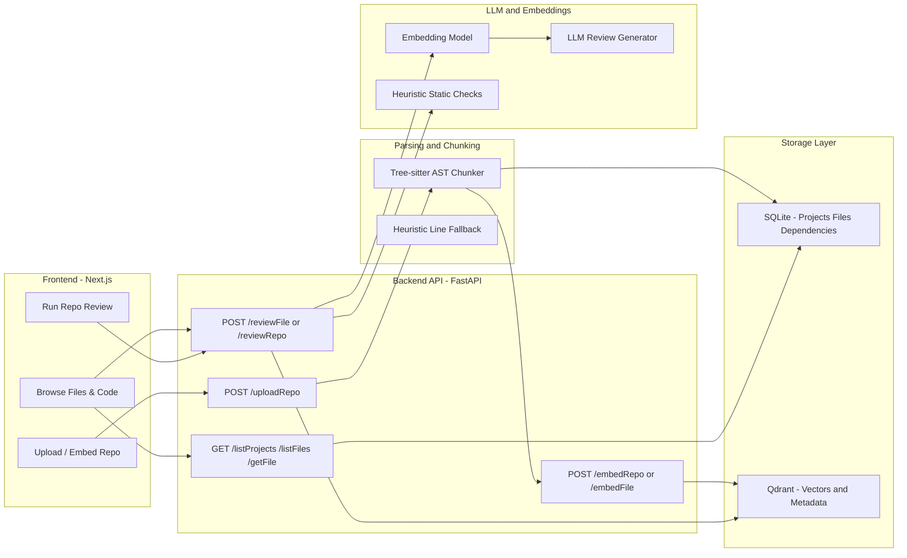

# CodeLens AI — AI Code Reviewer

[](https://fastapi.tiangolo.com/)
[](https://www.python.org/)
[](https://nextjs.org/)
[](https://react.dev/)
[](https://www.typescriptlang.org/)
[](https://tailwindcss.com/)
[](https://qdrant.tech/)
[](https://www.sqlite.org/)
[](https://ai.google.dev/)
[](https://openai.com/)
[](https://www.anthropic.com/)


CodeLens AI ingests a repository, parses it into AST chunks, embeds to Qdrant, and generates AI review findings at file or repo scope. The FastAPI backend handles parsing, chunking, embeddings, retrieval, and review. The Next.js frontend gives you upload, file tree browsing, code viewing with inline comments, and repo-level findings in a dark, GitHub-like UI.

## Highlights
- Upload a repo archive and auto-embed everything
- Language-agnostic AST chunking (Tree-sitter) for Python, JS/TS/TSX, Go, Java (class/function/block)
- Vector storage in Qdrant with dependency-aware retrieval
- File-level and repo-level reviews (structured JSON, cross-file aware)
- Dependency graph to expand retrieval across related files
- SQLite metadata (projects, files, dependency edges)
- Dark UI with syntax highlighting, jump-to-line, and grouped severities
- Pluggable LLM/embedding providers via env (Gemini, OpenAI, Claude)

## Architecture
- **Frontend (Next.js/React)**: Upload flow (`/upload`), file tree (`/files`), file review (`/code` with inline comments and jump-to-line), repo review (`/repo-review` with preview pane), dark theme with syntax highlighting.
- **API (FastAPI)**: Routes for ingest (`/uploadRepo`), embedding (`/embedRepo`, `/embedFile`), retrieval + review (`/reviewFile`, `/reviewRepo`), metadata (`/listProjects`, `/listFiles`, `/getFile`), and health.
- **Parsing & chunking**: Tree-sitter-based AST chunker (Python, JS/TS/TSX, Go, Java) extracts class/function/method blocks with byte-accurate spans; falls back to heuristics if parsing fails.
- **Embeddings & storage**: Gemini embeddings (or local heuristic fallback) with Qdrant vector store; payloads include path, language, and line spans; IDs are UUIDs.
- **Retrieval & review**: RAG pipeline pulls top-k chunks (plus dependency neighbors) from Qdrant/local, builds repo-aware prompts, runs LLM review (Gemini/OpenAI/Claude) with JSON findings and heuristic fallback.
- **Metadata**: SQLite tracks projects, files, and dependency graph edges; used for listing, filtering ignored paths, and dependency-aware retrieval.
- **Dependency graph**: Import-based edges for JS/TS/Python/Go/Java to widen retrieval context for cross-file issues.



## Project layout
- `frontend/` — Next.js app (upload, file tree, code review, repo review UI)
- `backend/` — FastAPI API (ingest, embed, retrieve/review, dependency graph, SQLite metadata)

Key backend modules:
- `app/main.py` — API routes (`/uploadRepo`, `/embedRepo`, `/reviewFile`, `/reviewRepo`, etc.)
- `app/ast_chunker.py` — Tree-sitter chunking by class/function/block (Python/JS/TS/Go/Java)
- `app/repo_parser.py` — Repo walk, filtering, language detection (`language_registry.json`)
- `app/rag_pipeline.py` — Retrieval (Qdrant + dependency neighbors) and review prompting
- `app/dependency_graph.py` — Import-based dependency edges (JS/TS/Python/Go/Java)
- `app/db.py` — SQLite metadata (projects, files, dependencies)

Key frontend pages:
- `/upload` — upload and trigger repo-wide embedding
- `/files` — project/file browser
- `/code` — file viewer with highlighted lines, jump-to-line, grouped severities
- `/repo-review` — repo-level findings list with preview pane

## Prerequisites
- Node 18+ and npm/pnpm/yarn
- Python 3.11+
- Qdrant (optional but recommended) — `docker run -p 6333:6333 qdrant/qdrant`
- Gemini key (optional): `GOOGLE_API_KEY`/`GEMINI_API_KEY` for embeddings + generation. Without it, the app falls back to local embeddings and heuristic review.

## Environment (add your own keys)
Create a shell env or `.env` files with your keys/URLs:
- Backend:
  - `EMBEDDING_PROVIDER` — `gemini` or `openai`.
  - `LLM_PROVIDER` — `gemini`, `openai`, or `anthropic`.
  - `GOOGLE_API_KEY` or `GEMINI_API_KEY` — enables Gemini embeddings + review.
  - `OPENAI_API_KEY` (if using OpenAI).
  - `ANTHROPIC_API_KEY` (if using Claude).
  - `QDRANT_URL` (optional) — point to your Qdrant instance (e.g., `http://localhost:6333`); unset to disable vector storage.
  - `STORAGE_DIR` (optional) — defaults to `backend/.data/python-backend`.
  - `DATABASE_PATH` (optional) — defaults to `STORAGE_DIR/projects.db`.
  - `GEMINI_EMBED_MODEL` (required for Gemini) — e.g., `models/gemini-embedding-001`.
  - `GEMINI_GEN_MODELS` (required for Gemini, comma list) — e.g., `gemini-3-flash-preview,gemini-3-flash-preview-latest`.
  - `OPENAI_EMBED_MODEL`, `OPENAI_LLM_MODEL` (required for OpenAI) — e.g., `text-embedding-3-small`, `gpt-4o-mini`.
  - `CLAUDE_MODEL` (required for Anthropic) — e.g., `claude-3-5-sonnet-latest`.
- Frontend:
  - `NEXT_PUBLIC_BACKEND_URL` — e.g., `http://127.0.0.1:8000`.

Example (backend shell):
```bash
export EMBEDDING_PROVIDER=gemini   # or openai
export LLM_PROVIDER=gemini         # or openai|anthropic
export GOOGLE_API_KEY=your_gemini_key
export QDRANT_URL=http://localhost:6333
export STORAGE_DIR=.data/python-backend
# export DATABASE_PATH=.data/python-backend/projects.db
```

Example (frontend shell):
```bash
export NEXT_PUBLIC_BACKEND_URL=http://127.0.0.1:8000
```

Example env files you can copy:
- `backend/.env.example`
- `frontend/.env.local.example`

## Backend setup
```bash
cd backend
python -m venv .venv && source .venv/bin/activate
pip install -r requirements.txt

# Env (examples)
export QDRANT_URL=http://localhost:6333          # optional; unset to stay local
# export GOOGLE_API_KEY=your_gemini_key          # optional; enables Gemini
# export STORAGE_DIR=.data/python-backend        # optional override

uvicorn app.main:app --reload
```

## Frontend setup
```bash
cd frontend
npm install   # or pnpm/yarn

# set backend URL if not default
export NEXT_PUBLIC_BACKEND_URL=http://127.0.0.1:8000

npm run dev
```

## Tests
- Backend (pytest):
  ```bash
  cd backend
  source .venv/bin/activate
  pytest
  ```
  Basic smoke tests ensure the API starts and responds.

## Typical flow
1) Open `/upload`, select a zip/file, and upload.  
2) Hit “Embed” (or use auto-embed) to chunk and upsert vectors to Qdrant.  
3) Browse files at `/files` or open `/code` to view code and run file-level review.  
4) Use `/repo-review` for cross-file findings.  
5) Click comments to jump to highlighted lines; severities are grouped for quick scanning.

## API (backend)
- `POST /uploadRepo` — upload archive/file; stores under `.data/python-backend/` and records manifest + dependencies.
- `POST /embedRepo` — embed all files (AST chunking) and upsert to Qdrant.
- `POST /embedFile` — embed a single file.
- `POST /reviewFile` — file-level review (retrieval + LLM/heuristic fallback).
- `POST /reviewRepo` — repo-level review (cross-file retrieval + intent parsing).
- `GET /listProjects` — list projects (from SQLite).
- `GET /listFiles` — list files for a project.
- `GET /getFile` — fetch file content.

## Behavior & defaults
- Filters out `__MACOSX`, `node_modules`, `.git`, build outputs, and files > 400KB.
- If `QDRANT_URL` is unset, retrieval uses local cosine similarity.
- If Gemini key is missing or quota is hit, embeddings/reviews fall back to local heuristics.
- Embedding payload includes path, language, and line spans; IDs are UUIDs.
- Metadata (projects, files, dependency graph) lives in `backend/.data/python-backend/projects.db`.

## Troubleshooting
- Qdrant connection refused: ensure `docker run -p 6333:6333 qdrant/qdrant` is running or unset `QDRANT_URL`.
- “no llm key provided”: set `GOOGLE_API_KEY`/`GEMINI_API_KEY` in the shell where you start the backend.
- Tree-sitter parse errors: ensure `tree-sitter-languages` dependencies are installed (reinstall `pip install -r requirements.txt` in the venv).

## Next ideas
- Git URL ingestion and PR/diff review
- Background jobs for embedding/review
- Auth + rate limiting
- Stored review history and diffs
- Additional language parsers and richer dependency graphs
